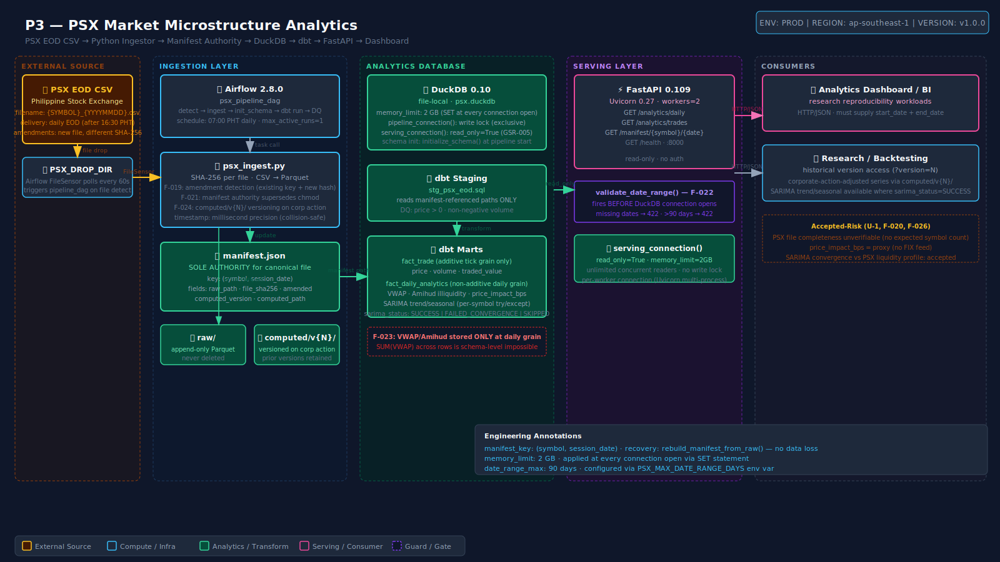

> **psx-analytics** — Manifest-authority, memory-bounded microstructure analytics platform for Philippine Stock Exchange EOD equity data with corporate-action versioning and isolated serving.

**Ecosystem context:** Operates fully independently — downstream consumer of no other pipeline in this ecosystem. The DuckDB file is file-local; there is no shared database instance with P2 or P6. Airflow is shared with P2 (same Airflow 2.8.0 installation) but the DAG is isolated to its own pool and connection.

---

## Table of Contents

- [Repository Layout](#repository-layout)
- [Architecture](#architecture)
- [Quick Start](#quick-start)
- [Service Endpoints](#service-endpoints)
- [Running the System](#running-the-system)
- [API Reference](#api-reference)
- [Configuration](#configuration)
- [Data Contracts / Schema](#data-contracts--schema)
- [Development](#development)
- [Failure Modes](#failure-modes)
- [Tech Stack](#tech-stack)
- [License](#license)

---

## Repository Layout

```
psx-analytics/
├── scripts/
│   ├── psx_ingest.py          ← F-019+F-021+F-024: manifest-based ingest + corporate-action versioning
│   └── duckdb_manager.py      ← F-022+GSR-005: date-range guard + read-only serving connection
├── serving/
│   └── psx_analytics_api.py                 ← FastAPI: F-022 validate_date_range() at every fact endpoint
├── dbt/
│   ├── models/
│   │   ├── staging/
│   │   │   └── stg_psx_eod.sql          ← manifest-path source (never glob raw/)
│   │   └── marts/
│   │       └── fact_daily_analytics.py  ← F-023: daily grain VWAP/Amihud; F-025: SARIMA isolation
│   ├── dbt_project.yml
│   └── profiles/profiles.yml.example
├── airflow/
│   └── dags/
│       └── psx_pipeline_dag.py    ← detect → ingest → schema-init → dbt run → DQ assertions
├── tests/
│   └── test_psx_analytics_regression.py  ← F-019/F-022/F-023/F-025 regression suite
├── governance/
│   ├── hardening-log.md
│   └── closure-declaration.md
├── .env.example
├── .gitignore
├── requirements.txt
└── README.md
```

**Runtime boundaries:** The Airflow scheduler and FastAPI serving layer run as separate processes. DuckDB enforces writer exclusivity: `pipeline_connection()` acquires the write lock during scheduled pipeline windows; `serving_connection(read_only=True)` is used by FastAPI and allows unlimited concurrent readers. These two paths never hold the lock simultaneously.

---

## Architecture



### Key Design Rules

`manifest.json` is the **sole authority** for which Parquet file is canonical for any `(symbol, session_date)` pair. The dbt staging model reads only manifest-referenced paths — never a glob against `raw/`. PSX file amendments create a new timestamped Parquet file; the manifest is updated to point to it; the prior file is retained but de-canonicalized. If `manifest.json` is lost, `rebuild_manifest_from_raw()` recovers the state by taking the latest-modified file per key.

`validate_date_range()` is called before any DuckDB connection is opened in FastAPI. Requests missing `start_date`/`end_date`, spanning more than `PSX_MAX_DATE_RANGE_DAYS` (default 90), or with `end_date < start_date` are rejected with HTTP 422 before any query executes. This is a hard memory guard, not a soft advisory.

Non-additive measures (`VWAP`, `Amihud illiquidity`, `price_impact_bps`) are computed and stored **only** at daily grain in `fact_daily_analytics`. `fact_trade` contains only additive tick-level measures (price, volume, traded value). `SUM(VWAP)` across rows is a schema-level impossibility, not a query-convention. This is the Kimball correctness boundary for F-023.

SARIMA estimation failures are **never fatal to a dbt run**. Per-symbol `try/except` wraps the SARIMAX fit; non-convergent symbols receive `sarima_status = "FAILED_CONVERGENCE"` with `NULL` trend/seasonal columns. The entire `fact_daily_analytics` table is always populated; only the SARIMA-derived columns are NULL for affected symbols.

The serving connection is permanently `read_only=True`. No FastAPI endpoint, no matter how constructed, can acquire the DuckDB write lock. The pipeline's exclusive write window is enforced by the Airflow DAG's sequential task structure; no manual trigger overlapping with a pipeline run is operationally safe.

`computed/` directory versioning follows `computed/v{N}/symbol/date/`. Corporate action sequence number `N` increments on each adjustment event. Prior versions are never deleted; `manifest.json` tracks the current canonical `computed_version` per `(symbol, date)`. FastAPI can serve any historical version via `?version=N`.

---

## Quick Start

**Prerequisites:** [Python 3.11](https://www.python.org/downloads/), [Apache Airflow 2.8.0](https://airflow.apache.org/docs/) (shared with P2 environment if applicable).

```bash
# 1. Configure environment
cp .env.example .env
# Edit .env — set PSX_DATA_ROOT (absolute path) and PSX_DUCKDB_PATH

# 2. Install dependencies
pip install -r requirements.txt

# 3. Initialize DuckDB schema
python3 -c "from scripts.duckdb_manager import initialize_schema; initialize_schema()"

# 4. Run regression suite (no live data required)
pytest tests/test_psx_analytics_regression.py -v
# Expected: all F-019/F-022/F-023/F-025 tests pass

# 5. Start serving API
uvicorn app.api:app --host 0.0.0.0 --port 8000 --workers 2

# 6. Load a PSX EOD CSV and trigger pipeline
cp /path/to/ALI_20250115.csv $PSX_DROP_DIR/
# Then trigger psx_pipeline_dag in Airflow UI (or CLI):
airflow dags trigger psx_pipeline_dag
```

> **Warning:** The Airflow DAG and the FastAPI server must not run simultaneous DuckDB write operations. `pipeline_connection()` acquires an exclusive write lock. If the pipeline is running, FastAPI's read-only connections are unaffected, but any accidental write attempt from a second pipeline instance will block. Set `max_active_runs=1` on `psx_pipeline_dag`.

---

## Service Endpoints

| Service | URL | Credentials |
|---|---|---|
| FastAPI serving layer | `http://localhost:8000` | None (no auth on analytics endpoints) |
| FastAPI interactive docs | `http://localhost:8000/docs` | None |
| Airflow UI (shared with P2) | `http://localhost:8080` | `admin` / `$AIRFLOW_ADMIN_PASSWORD` |
| DuckDB file (local) | `$PSX_DUCKDB_PATH` | File-local; no network port |

---

## Running the System

### Single pipeline run (manual)

```bash
# Drop a PSX EOD CSV into the drop directory
cp /path/to/SMPH_20250210.csv $PSX_DROP_DIR/

# Trigger pipeline
airflow dags trigger psx_pipeline_dag

# Verify manifest updated
python3 -c "
import json, os
with open(os.path.join(os.getenv('PSX_DATA_ROOT'), 'manifest.json')) as f:
    m = json.load(f)
print(list(m.items())[:3])
"
```

### Amendment handling (PSX corrects a prior day's file)

```bash
# PSX delivers corrected ALI_20250115.csv — drop as new file with different content
cp /path/to/ALI_20250115_amended.csv $PSX_DROP_DIR/ALI_20250115.csv
# psx_ingest.py detects existing manifest key with different SHA-256,
# records prior_raw_path, updates manifest to new file, sets amended=True.
# No data is deleted from raw/.
```

### API query (date range required on all fact endpoints)

```bash
# Valid: 7-day range for VWAP / Amihud
curl "http://localhost:8000/analytics/daily?symbol=ALI&start_date=2025-01-08&end_date=2025-01-15"

# Rejected: missing date range (HTTP 422)
curl "http://localhost:8000/analytics/daily?symbol=ALI"

# Rejected: range > 90 days (HTTP 422)
curl "http://localhost:8000/analytics/daily?symbol=ALI&start_date=2024-01-01&end_date=2025-01-15"
```

### Scheduled runs

`psx_pipeline_dag` is scheduled daily at `07:00 PHT` (after PSX EOD file delivery). Activation:

```bash
airflow dags unpause psx_pipeline_dag
```

---

## API Reference

> **Read-only.** All endpoints use `serving_connection(read_only=True)`. No write path is exposed.

| Method | Path | Description |
|---|---|---|
| `GET` | `/analytics/daily` | `fact_daily_analytics` for a symbol and date range. Required: `symbol`, `start_date`, `end_date`. Optional: `version` (computed version N). |
| `GET` | `/analytics/trades` | `fact_trade` tick records for a symbol and date range. Required: `symbol`, `start_date`, `end_date`. Max range: 90 days. |
| `GET` | `/manifest/{symbol}/{session_date}` | Returns canonical manifest entry for a `(symbol, session_date)` pair including `raw_path`, `computed_version`, and `amended` flag. |
| `GET` | `/health` | Returns DuckDB connection status, manifest record count, and `memory_limit` setting. |

---

## Configuration

```dotenv
# ── Data paths ────────────────────────────────────────────────────────────────
PSX_DATA_ROOT=/data/psx                   # Absolute path; must exist before first run
PSX_DUCKDB_PATH=/data/psx/psx.duckdb     # DuckDB file; created on first initialize_schema()
PSX_DROP_DIR=/data/psx/drop               # Airflow FileSensor watches this directory

# ── DuckDB resource limits ────────────────────────────────────────────────────
DUCKDB_MEMORY_LIMIT=2GB                   # Applied at every connection open (SET memory_limit)
PSX_MAX_DATE_RANGE_DAYS=90               # F-022 guard; override for admin queries only

# ── dbt ───────────────────────────────────────────────────────────────────────
DBT_PROJECT_DIR=/opt/airflow/dbt         # Mounted into Airflow container
DBT_PROFILES_DIR=/opt/airflow/dbt/profiles

# ── FastAPI ───────────────────────────────────────────────────────────────────
API_HOST=0.0.0.0
API_PORT=8000
API_WORKERS=2                             # Each worker gets its own read-only DuckDB connection
```

---

## Data Contracts / Schema

### `manifest.json` (manifest authority, F-019)

```yaml
key: (symbol, session_date)              # canonical dedup key
fields:
  raw_path: string                       # absolute path to canonical Parquet file in raw/
  prior_raw_path: string | null          # path to superseded file if amended=True
  file_sha256: string                    # SHA-256 of canonical raw_path
  amended: boolean                       # True if PSX delivered a correction for this key
  computed_version: integer              # current canonical computed/ version number
  computed_path: string                  # absolute path to computed/v{N}/symbol/date/
  ingested_at: ISO8601                   # millisecond precision (prevents same-second collision)
manifest_key: (symbol, session_date)
recovery: rebuild_manifest_from_raw() scans raw/ and takes latest-modified file per key
```

### `fact_daily_analytics` (non-additive daily grain, F-023)

```yaml
grain: one row per (symbol_key, session_date_key)
non_additive_measures:
  - vwap: total_value / total_volume at daily grain — NOT summable across days
  - amihud_illiquidity: |daily_return| / daily_volume
  - price_impact_bps: (high - low) / close × 10000
additive_measures:
  - total_volume, total_value, trade_count
sarima_columns:
  - trend_component, seasonal_component: NULL when sarima_status != 'SUCCESS'
  - sarima_status: SUCCESS | FAILED_CONVERGENCE | INSUFFICIENT_DATA | SKIPPED_NO_STATSMODELS
quality_gates:
  - price > 0 at stg_psx_eod layer
  - non-negative volume assertion
  - manifest-path source (not glob) enforced in stg_psx_eod.sql
```

---

## Development

### Without Airflow (scripts only)

```bash
python3 -m venv .venv && source .venv/bin/activate
pip install -r requirements.txt

export PSX_DATA_ROOT=/tmp/psx_dev PSX_DUCKDB_PATH=/tmp/psx_dev/dev.duckdb
mkdir -p /tmp/psx_dev/raw /tmp/psx_dev/drop

python3 -c "from scripts.duckdb_manager import initialize_schema; initialize_schema()"
python3 -c "from scripts.psx_ingest import ingest_psx_csv; ingest_psx_csv('tests/fixtures/ALI_20250115.csv')"
```

### Tests

| Suite | Command | Coverage |
|---|---|---|
| Full hardening regression | `pytest tests/test_psx_analytics_regression.py -v` | F-019/F-021/F-022/F-023/F-025/GSR-005 |
| With coverage report | `pytest tests/test_psx_analytics_regression.py -v --cov=scripts --cov=serving` | All modules |
| FastAPI endpoints only | `pytest tests/test_psx_analytics_regression.py -v -k "api"` | F-022 guard paths |

### Lint

```bash
ruff check scripts/ serving/ && black --check scripts/ serving/
```

---

## Failure Modes

| Symptom | Cause | Fix |
|---|---|---|
| `ValueError: date range exceeds 90 days` from FastAPI | Client sent unguarded full-history query | Add `start_date`/`end_date` to request; or set `PSX_MAX_DATE_RANGE_DAYS` env override for admin ops |
| DuckDB `IO Error: Could not set lock on file` | Two pipeline instances running concurrently, both attempting write lock | Set `max_active_runs=1` on `psx_pipeline_dag`; kill the second instance; DuckDB file is not corrupted |
| `fact_daily_analytics.vwap` returns nonsensical values | VWAP computed at tick grain (F-023 regression) | Verify `stg_psx_eod.sql` selects from manifest path not raw glob; re-run dbt run on `fact_daily_analytics` only |
| SARIMA columns are all NULL for all symbols | `statsmodels` not installed in dbt Python model environment | Install `statsmodels>=0.14.0` in the dbt runner environment; `sarima_status = SKIPPED_NO_STATSMODELS` is expected without it |
| Manifest shows `amended=False` after PSX correction delivery | Second file has same content SHA-256 as original (non-substantive PSX re-delivery) | This is correct behavior — idempotent ingest. If PSX claims the file is substantively corrected, request a file with verifiably different content |
| `manifest.json` missing after disk event | Disk failure or accidental deletion | Run `python3 -c "from scripts.psx_ingest import rebuild_manifest_from_raw; rebuild_manifest_from_raw()"` — rebuilds from raw/ (no data loss; all Parquet files preserved) |
| `fact_daily_analytics` missing symbols after corporate action | `computed/` version mismatch; stale manifest pointing to pre-adjustment version | Run `create_computed_version()` for affected symbols, increment version; re-run dbt models for mart only |
| FastAPI `503` under high concurrent load | Multiple workers contending on DuckDB read connections | DuckDB `read_only=True` supports unlimited concurrent readers; verify workers are using `serving_connection()` not `pipeline_connection()` |

---

## Tech Stack

| Layer | Technology |
|---|---|
| Ingestion | Python 3.11 (`psx_ingest.py`) + `manifest.json` authority |
| Analytics DB | DuckDB 0.10 (file-local; `memory_limit=2GB`) |
| Data format | Parquet (pyarrow 14.x backend) |
| Transform | dbt-core 1.7.0 + dbt-duckdb 1.7.0 |
| SARIMA forecasting | statsmodels 0.14 (optional; per-symbol fault isolation) |
| Serving | FastAPI 0.109 + Uvicorn 0.27 |
| Orchestration | Apache Airflow 2.8.0 (shared with P2) |
| Testing | pytest 8.x + pytest-cov + httpx (FastAPI test client) |
| Timezone | pendulum 3.x |

---

## License

MIT — see [`LICENSE`](LICENSE).
